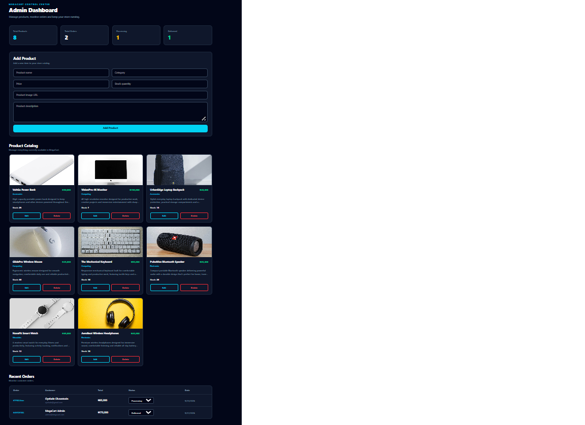
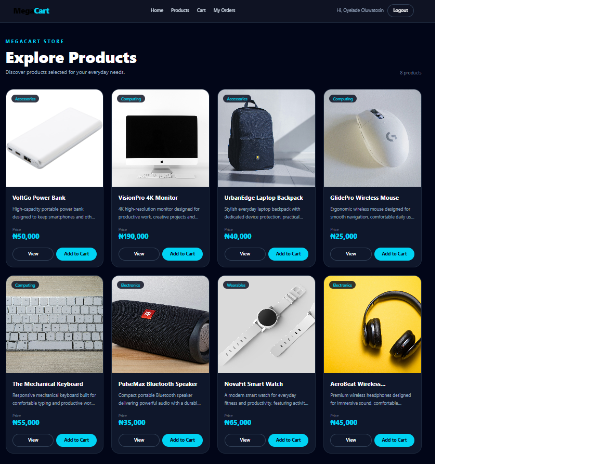
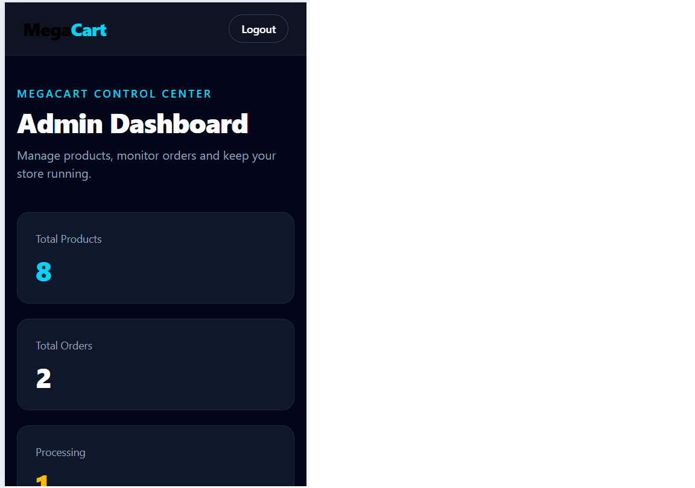
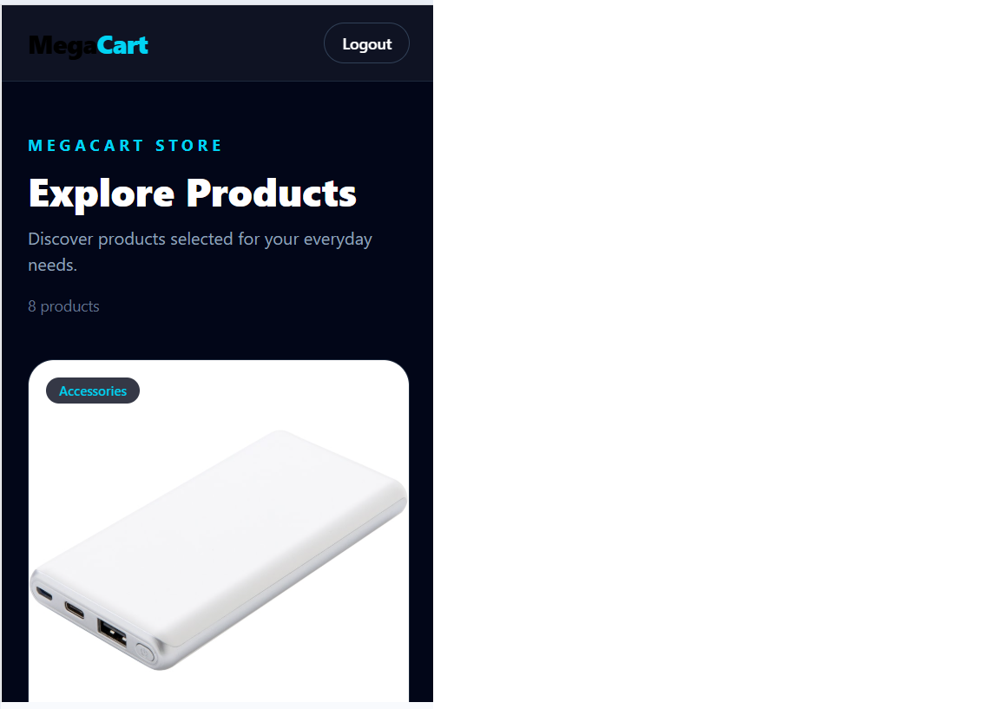

🛒 MegaCart — Full-Stack E-Commerce Web Application

MegaCart is a modern full-stack e-commerce web application built to demonstrate real-world online shopping functionality, including product management, authentication, shopping cart operations, checkout, order tracking, and role-based administration.

The project was developed as a full-stack application using the MERN stack with a responsive Tailwind CSS interface.

---

## Preview

✨ Features

👤 Customer Features

- User registration and login
- JWT-based authentication
- Browse product catalog
- View product information
- Add products to cart
- Increase/decrease product quantities
- Remove products from cart
- Persistent shopping cart using Local Storage
- Checkout with shipping information
- Cash-on-delivery and card payment selection
- Automatic order creation
- View personal orders
- View individual order details
- Track order status

🛡️ Admin Features

- Secure admin authentication
- Role-based access control
- Admin dashboard
- Product statistics
- Order statistics
- Add products
- Edit products
- Delete products
- View product inventory
- View customer orders
- Update order status
- Monitor processing and delivered orders

🔐 Security

- Password hashing with bcryptjs
- JWT authentication
- Protected API routes
- Admin-only API endpoints
- User-specific order access
- Environment variables for sensitive configuration

---

🧰 Technologies Used

Frontend

- React
- Vite
- Tailwind CSS
- React Router DOM
- Axios
- JavaScript (ES6+)

Backend

- Node.js
- Express.js
- MongoDB
- Mongoose
- JWT
- bcryptjs
- CORS
- dotenv

Development Tools

- VS Code
- Git & GitHub
- Thunder Client
- MongoDB Atlas

---

🏗️ Project Architecture

MegaCart/
│
├── backend/
│   ├── config/
│   │   └── db.js
│   │
│   ├── controllers/
│   │   ├── authController.js
│   │   ├── productController.js
│   │   └── orderController.js
│   │
│   ├── middleware/
│   │   └── authMiddleware.js
│   │
│   ├── models/
│   │   ├── User.js
│   │   ├── Product.js
│   │   └── Order.js
│   │
│   ├── routes/
│   │   ├── authRoutes.js
│   │   ├── productRoutes.js
│   │   └── orderRoutes.js
│   │
│   ├── scripts/
│   │   └── createAdmin.js
│   │
│   ├── .env
│   ├── .gitignore
│   ├── package.json
│   └── server.js
│
├── frontend/
│   ├── src/
│   │   ├── components/
│   │   ├── context/
│   │   │   ├── AuthContext.jsx
│   │   │   └── CartContext.jsx
│   │   │
│   │   ├── pages/
│   │   │   ├── Home.jsx
│   │   │   ├── Products.jsx
│   │   │   ├── Login.jsx
│   │   │   ├── Register.jsx
│   │   │   ├── Cart.jsx
│   │   │   ├── Checkout.jsx
│   │   │   ├── MyOrders.jsx
│   │   │   ├── OrderDetails.jsx
│   │   │   └── AdminDashboard.jsx
│   │   │
│   │   ├── services/
│   │   │   └── api.js
│   │   │
│   │   ├── App.jsx
│   │   ├── index.css
│   │   └── main.jsx
│   │
│   └── package.json
│
└── README.md

---

🔄 Application Flow

                     MegaCart
                         │
              ┌──────────┴──────────┐
              │                     │
          Customer                Admin
              │                     │
       Browse Products       Manage Products
              │                     │
          Add to Cart         Manage Orders
              │                     │
           Checkout          Update Status
              │                     │
          Create Order             │
              │                     │
              └──────────┬──────────┘
                         │
                      Express
                         │
                  RESTful API
                         │
                      MongoDB

---

🔑 Authentication Flow

MegaCart uses JSON Web Tokens (JWT) for authentication.

User Login
    ↓
Backend validates credentials
    ↓
Password checked with bcrypt
    ↓
JWT generated
    ↓
Token stored by frontend
    ↓
Token sent with protected requests
    ↓
Authentication middleware verifies token
    ↓
Role middleware checks permissions

There are two roles:

- "user"
- "admin"

Admin-only operations are protected on the backend using role-based middleware.

---

📡 API Endpoints

Authentication

Method| Endpoint| Description
POST| "/api/auth/register"| Register a user
POST| "/api/auth/login"| Login

Products

Method| Endpoint| Description
GET| "/api/products"| Get all products
GET| "/api/products/:id"| Get a product
POST| "/api/products"| Create product
PUT| "/api/products/:id"| Update product
DELETE| "/api/products/:id"| Delete product

Product creation, updating and deletion require administrator privileges.

Orders

Method| Endpoint| Description
POST| "/api/orders"| Create an order
GET| "/api/orders/my-orders"| Get logged-in user's orders
GET| "/api/orders/:id"| Get an individual order
GET| "/api/orders"| Get all orders (Admin)
PUT| "/api/orders/:id/status"| Update order status (Admin)

---

🛒 Order Tracking

Orders move through the following states:

Processing
    ↓
Confirmed
    ↓
Shipped
    ↓
Delivered

An order can also be cancelled when applicable.

Customers can view their order status from the Order Details page.

---

⚙️ Installation

1. Clone the repository

git clone YOUR_GITHUB_REPOSITORY_URL
cd MegaCart

2. Install backend dependencies

cd backend
npm install

3. Create backend environment variables

Create a ".env" file inside the "backend" folder:

PORT=5000
MONGO_URI=your_mongodb_connection_string
JWT_SECRET=your_secure_jwt_secret

Do not commit the ".env" file to GitHub.

4. Start the backend

npm run dev

The API will run on:

http://localhost:5000

5. Install frontend dependencies

Open another terminal:

cd frontend
npm install

6. Start the frontend

npm run dev

The frontend will normally run on:

http://localhost:5173

---

👑 Admin Account

For local development, an administrator can be created using:

cd backend
npm run admin

The admin credentials should be handled securely and should not be exposed in production documentation or public repositories.

---

🧪 Testing

The application was tested across the following workflows:

Authentication

- User registration
- User login
- Admin login
- Invalid login credentials
- Protected routes
- Role-based access

Products

- Product creation
- Product retrieval
- Product editing
- Product deletion
- Inventory display

Shopping

- Add to cart
- Update quantity
- Remove item
- Clear cart
- Checkout

Orders

- Create order
- View personal orders
- View order details
- Verify stock deduction
- Admin order retrieval
- Update order status
- Customer order tracking

---

🌐 Future Improvements

Possible future enhancements include:

- Online payment integration
- Product search and filtering
- Product reviews and ratings
- Wishlist functionality
- Pagination
- Image upload service
- Email order notifications
- Advanced analytics
- Inventory alerts
- Refresh-token authentication
- Automated testing
- Production monitoring

---

🎯 Project Objective

MegaCart was developed to demonstrate practical full-stack development skills through the implementation of a complete e-commerce workflow.

The project combines:

- Frontend development
- REST API development
- Database integration
- Authentication
- Authorization
- CRUD operations
- State management
- Order processing
- Responsive UI development

---

👨‍💻 Developer

Oluwatobi Oluwagbohun

Full-Stack Developer

Built with React, Node.js, Express, MongoDB and Tailwind CSS.

---

📄 License

This project was created for educational, as Thiranex task and portfolio purposes.